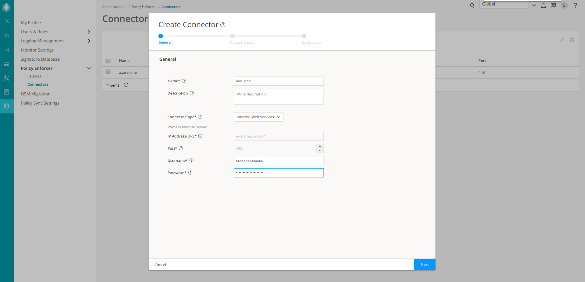

# Juniper Connected Security Multicloud Demo

Hey look I made an edit

### Overview

This project provides a set of scripts and infrastructure configurations to rapidly roll out a multicloud topology
built around the Juniper Connected Security solution using vSRX devices as cloud security enforcement points.

This project is designed to be customizable and scalable with minimal additional effort required. The project relies on the following tools:

- Terraform
    - AWS provider
    - Azure provider
    - VMWare provider
- Ansible
    - PyEZ Ansible JunOS
- Python

# Getting Started

## Pre-requisites

- A valid account in AWS, Azure
- A valid SkyATP realm
- Valid SRX feature licenses for all vSRX instances:
  - SkyATP
  - AppID
  - IPS
- A deployment workstation with the following software packages:
  - Docker
  - AWS CLI client (optional, see below)
  - Azure CLI client (optional, see below)

Note: This toolset has been tested on Ubuntu 16.04.1 with Docker 19.03.5    

## Setup

### Clone the repository

``` shell
$ mkdir /path/to/project
$ cd /path/to/project
$ git clone https://github.com/mckenziejw/multicloud-demo
```
### Create an RSA key pair. This will be used to secure instances requiring public key authentication.

The following formats are supported:

- OpenSSH public key format (the format in ~/.ssh/authorized_keys). If you connect using SSH while using the EC2 Instance Connect API, the SSH2 format is also supported.
- Base64 encoded DER format
- SSH public key file format as specified in RFC4716
- SSH private key file format must be PEM (for example, use ssh-keygen -m PEM to convert the OpenSSH key into the PEM format)

For simplicity, create the key without adding a passphrase.

```shell
$ ssh-keygen -f lab_key -t rsa -b 2048 -m pem
Generating public/private rsa key pair.
Enter passphrase (empty for no passphrase): <enter>
Enter same passphrase again: <enter>
Your identification has been saved in lab_key.
Your public key has been saved in lab_key.pub.
The key fingerprint is:
SHA256:mMdJClWKB/wcWGskKjqwzFFJWsWOe2PWTcKKQUS3kwM lab@deployer
The key's randomart image is:
+---[RSA 2048]----+
|  +E*=+..        |
|  ++=B+o         |
|ooo =B*..        |
|=o.o ==O o       |
|+o  + * S        |
| . o * o .       |
|    + .          |
|                 |
|                 |
+----[SHA256]-----+
```

### Move generated keypair to the ansible folder

```shell
$ mv lab_key /path/to/project/multicloud-demo/ansible
$ mv lab_key.pub /path/to/project/multicloud-demo/ansible
```

### Set the value of the `rsa_key_name` key in `deployment.yml` to the name of your generated key

```YAML
rsa_key_name: &default_key_name lab_key
```

### Generate an Azure service principal

If you do not already have an Azure service principal with a client secret, follow the instructions in the Terraform docs [here](terraform.io/docs/providers/azurerm/guides/service_principal_client_secret.html#creating-a-service-principal-using-the-azure-cli)

### Generate an AWS IAM role with programmatic access

If you do not already have an IAM user for your account with programmatic access enabled, create one according to the AWS documentation [here](https://docs.aws.amazon.com/IAM/latest/UserGuide/id_users_create.html)

### Define the deployment settings

All configurations are set in two documents:
- _deployment.yml_: defines the network and application topology for the lab infrastructure
- _credentials_: contains AWS access credentials of the IAM user created above

Configuration details are discussed in [Detailed Configuration](#detailed-config)

#### Configure the S3 Backend

Create an S3 bucket following instructions [here]

Set the S3 bucket settings in the deployment vars file:

```YAML
terraform:
  lab_domain: juniper.net
  s3_backend: 
    bucket: <your bucket name>
    key: "<your bucket container key>"
    region: <bucket region>
```

#### Define AWS Provider settings

Configure the SRX and web server AMI and instance type settings for your region:

```YAML
aws:
    region: <your region>
    default_srx_ami: &aws_default_srx_ami <your srx ami>
    default_web_server_ami: &aws_default_web_server_ami <your srx ami>
    default_az: &aws_default_az <your availability zone>
    default_srx_instance_type: &aws_default_srx_instance_type "<your instance type>"
    default_web_server_instance_type: &aws_default_web_server_instance_type "<your server instances type>"
    default_key_name: &aws_default_key_name lab_key
```

#### Define AWS credentials

The credentials for your AWS IAM account should be stored in the `credentials` file.

```shell
[default]
aws_access_key_id = <your key id>
aws_secret_access_key = <your key>
```

#### Define Azure Provider settings

Configure the SRX and server settings. Configure the details of your Azure service principal account within the deployment vars file.

```YAML
 azurerm:
    version: "1.33.1"
    client_id: <your client id>
    secret: <your secret>
    subscription_id: <your subscription id>
    tenant_id: <your tenant id>
    default_srx_instance_type: &az_default_srx_instance_type "Standard_D3"
    default_web_server_instance_type: &az_default_web_server_instance_type "Standard_DS1_v2"
    default_srx_image: &az_default_srx_image
      publisher: juniper-networks
      offer: vsrx-next-generation-firewall-payg
      sku: vsrx-azure-image-byol
      version: "19.4.1"
      plan: vsrx-azure-image-byol
      product: vsrx-next-generation-firewall-payg
    default_web_server_image: &az_default_web_server_image
      publisher: Canonical
      offer: UbuntuServer
      sku: "16.04-LTS"
      version: latest
```

#### Define the Resource Group name and Location for the Azure instances

Set the resource group name and location under `terraform/resources/azure`. Note that if this resource group does not already exist, Terraform will create it.

```YAML
azure:
    resource_groups:
      - name: &az_resource_group1 <your resource group>
        location: &az_location1 <your location>
```

#### Configure license files

Import the license file for each device to the `ansible/static_files` directory. Configure the device-specific license for each device under `srx_configs/device_name/license_file`

```YAML
srx_configs:
  vSRX-1:
    license_file: <vSRX1 license file name>
...
  aws-vsrx1:
    license_file: <aws-vsrx1 license file name>
...
  azure-vsrx1:
    license_file: <azure-vsrx1 license file name>
```

#### Validate that all user-defined values have been set.

You can quickly verify that you have configured all custom settings using `egrep` to look for "NEEDS VALUE".

```shell
$ cat deployment.yml | egrep "NEEDS VALUE"
```

This command should return nothing

### Generate the Terraform plan

The `create_plan.py` script will take user-defined values along with the `terra_template.j2` Jinja template and produce the terraform plan describing our infrastructure: `out.tf`

A Docker image, `autofunbot/junos_automator` is provided in the DockerHub repository and contains all required software and dependencies for this demo. 

```shell
$ cd /path/to/project/multicloud-demo
$ sudo docker run -it --rm -v $PWD:/playbooks autofunbot/junos_automator python create_plan.py --template terra_template.j2 --varsfile deployment.yml
``` 
### Initialize the Terraform backend

Before applying the plan, you must initialize the Terraform backend. This will load all plugins required by your plan and configure initial state.

```shell
$ sudo docker run -it -v $PWD:/playbooks -e AWS_SHARED_CREDENTIALS_FILE="credentials" autofunbot/junos_automator terraform init
```
### Subscribe to AWS plan

Navigate to the `AWS Marketplace Subscriptions` service. Click on `Discover Products` and search for the vSRX subscription. Select the desired vSRX subscription.


Click "Continue to Subscription". Click on "Accept Terms." You have now subsribed to the plan and can now close the window.


### Accept Terms for Azure image

  NOTE: The current version of this code uses a custom image and does not require this step.

Before deploying the vSRX on Azure you will need to accept the Marketplace terms. You can do this from any system with the Azure CLI client installed. Replace the urn with the urn for your image. URN format is `publisher:offer:sku:version`.

```shell
$ az vm image accept-terms --urn juniper-networks:vsrx-next-generation-firewall-payg:vsrx-azure-image-byol:19.4.1
```

### Execute the Terraform plan

Apply the generated Terraform plan. Pass in the `credentials` file created in an earlier step using the `AWS_SHARED_CREDENTIALS_FILE` environment variable.  

  Note: While the Terraform plan should finish running in 10-15 minutes, it may take up to 30 minutes before all instances are reachable

```shell
$ sudo docker run -it -v $PWD:/playbooks -e AWS_SHARED_CREDENTIALS_FILE="credentials" autofunbot/junos_automator terraform apply -auto-approve
```
    Note: Due to Azure's dependency handling, you may need to rerun this command a second time to finish creating all resources.

### Generate Ansible variables files

The `master_deployer.py` script does the following:
a. Refresh the Terraform state until all instances show assigned public IPs (This may take up to 20 minutes)
b. Generate a `host_var` file for each vSRX instance in `ansible/host_vars`
c. Populate the inventory file for Ansible.

```shell
$ cd /path/to/project/multicloud-demo/terraform
$ sudo docker run -it --rm -v $PWD:/playbooks -e AWS_SHARED_CREDENTIALS_FILE="credentials" autofunbot/junos_automator python master_deployer.py --varsfile deployment.yml --inventoryfile test 
``` 

### Apply instance configurations with Ansible

The `site.yml` playbook does the following:
    a. Apply configurations to all vSRX instances. Configurations are defined in `deployment.yml` in the `srx_configs` section.
    b. As provided, configurations establish a full mesh of IPSec connections between all devices, and establish BGP peering between all vSRX instances, sharing all internal routes. It is not recommended to modify the routing configurations from the default.
    c. Install the provided vSRX licenses

```shell
$ cd /path/to/project/multicloud-demo
$ sudo docker run -it --rm -v $PWD:/playbooks autofunbot/junos_automator ansible-playbook -i ansible/test ansible/site.yml
```

### Add cloud connectors to Security Director for AWS and Azure

1. Connect to Security Director

Connect to your local JunOS Space instance and navigate to Security Director.


2. Navigate to Administration->Policy Enforcer->Connectors. Click the `+` icon to add a connector instance.


3. Navigate to Administration->Policy Enforcer->Connectors. Click the `+` icon to add a connector instance.

Select `Azure` from the `ConnectorType` dropdown. Populate the `Username` field with your Azure Service Principal Client ID. Input your Service Principal Secret in the `Password` field. Add your Subscription ID and Tenant ID to the matching fields.


4. In the `Network Details` dialog, select the Tenant matching the Azure Virtual Network defined in your deployment vars file. Click `Next`.


5. In the `Metadata` dialog. Select all boxes for all named Tags. Do not select the row with your Virtual Network Name.


Under the `Configuration Key` section. Set the values for `SRX Username`, `SRX Identifier Tag` and `Infected Host Security Group` to the values set in your deployment file. Click `Upload` next to `SRX Configuration Key` and upload your private RSA key. Click `Finish` and insure that the connector is added.


6. Select `Amazon Web Services` from the `ConnectorType` dropdown. Input the AWS IAM account Secret Key ID in the `Username` field and the Secret Key in the `Password` field. Click `Next` and verify that the connector is added.



7. In the `Network Details` dialog, select the region configured in your deployment file from the `Context` dropdown. Select the Tenant matching the Amazon VPC defined in your deployment vars file. Click `Next`.


8. In the `Metadata` dialog. Select all boxes for all named Tags. Do not select the row with your Virtual Network Name.

Under the `Configuration Key` section. Set the values for `SRX Username`, `SRX Identifier Tag` and `Infected Host Security Group` to the values set in your deployment file. Click `Upload` next to `SRX Configuration Key` and upload your private RSA key. Click `Finish` and insure that the connector is added.


9. Navigate to `Devices->Security Devices` and verify that all cloud instances have been discovered.


### Add the on-prem instance to Security Director

1. Navigate to `Devices->Device Discovery` and create a discovery job by pressing the `+` icon.


2. In the `Add Device Discovery Target` dialog, configure the name and target settings according to your environment.


3. In the `Specify Probes` dialog, select the probes appropriate to your environment. Using the default lab settings, select only `Use Ping`.


4. In the `Specify Credentials` dialog, enter credentials for your on-prem device. If using the lab defaults, the username/password combo is lab/Juniper123!


5. Click `Next` in the `Specify Device Fingerprint` dialog.


6. In the `Schedule Discovery Job` dialog, uncheck the `Import and Publish Policies` option. Select `Run now` and click `Finish` and then `OK`. Verify that the job completes successfully


### Import existing Firewall and NAT Policies

    Note: This was tested in Security Director 19.3R1. In this release it is recommended to configure only standard Firewall Policies, not Unified Policies.

1. Navigate to `Devices->Security Devices`. Select all devices, right click and select `Import`.


2. Select all firewall and NAT policies. Click `Next`.


3. Verify that the `Conflict Resolution` dialog shows no conflicts, and click `Finish`. Click `OK` on summary screen.


### Add the ATP feed source

  Note: This has been tested with SkyATP, but should also work with the JATP appliance.

1. Before adding the ATP feed source you must first verify that the cloud instances have been discovered and successfully added to the Secure Fabric sites for their connectors. If you attempt SkyATP enrollment before all instances have been added to their Secure Fabric sites the process will fail.

Navigate to `Devices->Secure Fabric`. Hover the `Enforcement Point` for each cloud site and ensure that the cloud instances pop up under `Controller Firewall.`


  Note: In this example we are deploying threat prevention policies only on the cloud instances.

2. Navigate to `Configure->Threat Prevention->Feed Sources` and click `+` to add a new feed source.


3. In the `Sky ATP Realm Credential` dialog, enter the details for your SkyATP realm. Click `Next`.


4. In the `Site` dialog, select all Secure Fabric Sites containing your cloud instances. Click `Next`.


5. In the `Global Configuration` dialog, check the boxes under `Logging` for `Malware` and `Host Status`. Click `Finish` to add feed connector.


6. Navigate to `Devices->Security Devices`. Check the `Feed Status` column for each cloud instance and ensure it is populated with the name of your SkyATP Realm. This process may take up to 5 minutes.

### Create a Policy Enforcement Group for the cloud instances

1. Navigate to `Configure->Shared Objects->Policy Enforcement Groups`. Click the `+` icon to create a new PEG.


2. Name the Policy Enforcement Group. Select the subnets associated with the `trust` and `dmz` zones on the cloud instances. Click the `->` arrow to select these subnets. Click `OK` to create the PEG.


### Create a Threat Prevention Policy

1. To define a Threat Prevention Policy, navigate to `Configure->Threat Prevention->Policies` and click `+` to define a new policy.


2. Configure the policy. Shown below are the settings for the recommended demo, but you may customize as fits your use case.

- Check `Include C&C profile in policy`. Leave settings as default.
- Check `Include infected host profile in policy`. Under `Actions` select `Quarantine` and enter the name of your quarantine security group. For this demo the default is `quarantine`.
- Check `Include malware profile in policy`. Select `SkyATP` as the `Feed Type`. Toggle the `HTTP File Download` option and select the default profile under `Device Profile`. Leave all other settings at their defaults.


3. Click `Assign to Group` to apply the Threat Prevention Policy to the cloud Policy Enforcement Group created in a previous step.


4. In the `Create Policy Enforcement Group` dialog, check the box next to your cloud PEG (`cloud-peg`) and click the `->` icon to select. Click `OK` to apply the Threat Prevention Policy. Click `Update` at the `View Change List` dialog.

  


### Define security policies using metadata tagging defined in `deployment.yml`

1. Delete all existing Firewall Policies. Navigate to `Configure->Firewall Policy->Standard Policies`. Select all policies under `Device Specific Policies` matching your cloud instances and click the trash icon to delete.

    Note: For this demo we are assuming the on-prem vSRX is being used simply to provide PE access to cloud networks. It is not being treated as an enforcement point.


2. Define Security Policies to provide secured access to your cloud server instances. You will use metadata-based dynamic address groups to accomplish this. The default metadata uses three tags attached to server instances:

- Name
- Tier
- Department

Which are assigned as follows

- Name: aws-web-server-1  
  Department: finance  
  Tier: web  

- Name: aws-db-server-1  
  Department: finance  
  Tier: db  

- Name: azure-web-server-1  
  Department: hr  
  Tier: web  

- Name: azure-db-server-1  
  Department: hr  
  Tier: db  

3. Define a group policy, applied to all cloud instances.


4. In the `Standard Policies` page, locate the newly created policy and click `Add Rule` to add rules. 


Configure the following rule:  

- Name: finance-web-to-db  
  Description: Allow all traffic from the *web* tier to the *db* tier for instances in the *finance* department.  
  Src. Zone: Any  
  Src. Address: Provider = PE AND Department = finance AND Tier = web  
  Src. Expression: Provider = PE AND Department = finance AND Tier = web  
  Dest. Zone: Any  
  Dest. Address: Provider = PE AND Department = finance AND Tier = db  
  Dest. Expression: Provider = PE AND Department = finance AND Tier = db  
  Service: Any  
  Action: Permit  


  


5. Repeat the process from step 4 to add the following rules:


- Name: hr-web-to-db  
  Description: Allow all traffic from the *web* tier to the *db* tier for instances in the *hr* department.  
  Src. Zone: Any  
  Src. Address: Provider = PE AND Department = hr AND Tier = web  
  Src. Expression: Provider = PE AND Department = hr AND Tier = web  
  Dest. Zone: Any  
  Dest. Address: Provider = PE AND Department = hr AND Tier = db  
  Dest. Expression: Provider = PE AND Department = hr AND Tier = db  
  Service: Any  
  Action: Permit   

- Name: allow-outbound  
  Description: Allow all outbound sessions from your private zones (by default *trust* and *dmz*) to the internet(*untrust*)  and the VPN zone (*vpn*)  
  Src. Zone: trust dmz   
  Src. Address: Any  
  Dest. Zone: untrust  
  Dest. Address: Any  
  Service: Any  
  Action: Permit  
  Advanced Security: Threat Prevention Policy (my-tp-policy)  

- Name: allow-vpn-inbound  
  Description: Allow all inbound sessions from the VPN zone (*vpn*) destined to the private cloud zones (*trust* and *dmz*)  
  Src. Zone: vpn  
  Src. Address: Any  
  Dest. Zone: trust dmz  
  Dest. Address: Any  
  Service: Any  
  Action: Permit  

6. Save and publish new policy rules.

Click `Save` to save new policy rules. Click `Update` to push new rules to the devices. In the `Update Firewall Policy` dialog, click `Publish and Update` and insure policies are pushed successfully.


### Verify expected security behavior

At this point you have enabled metadata filter-based policies to control East-West traffic within your cloud environments and configured Threat Prevention policies on internet traffic to detect potential malware downloads. In this section you will first validate that the tag-based dynamic address groups are being populated. You will then add a host to the infected host feed by downloading a fake malware file and verifying that the host is automatically isolated.

1. From your deployment station, verify reachability to all cloud server instances.

    Note: You will need the `lab_key` RSA key set in your `deployment.yml` to authenticate to AWS instances. For Azure instances you can authenticate with the crentials defined in `deployment.yml` which by default are `lab/Juniper123!`.

```shell
lab@deployer:~/multicloud-demo/ansible$ ssh ec2-user@10.0.1.10 -i lab_key
The authenticity of host '10.0.1.10 (10.0.1.10)' can't be established.
ECDSA key fingerprint is SHA256:8jFPT4cCJdVH3DZiSHFrKRNsJygi5L8C3oDU8tdfK2c.
Are you sure you want to continue connecting (yes/no)? yes
Warning: Permanently added '10.0.1.10' (ECDSA) to the list of known hosts.

       __|  __|_  )
       _|  (     /   Amazon Linux 2 AMI
      ___|\___|___|

https://aws.amazon.com/amazon-linux-2/
[ec2-user@ip-10-0-1-10 ~]$
```  

```shell
lab@deployer:~/multicloud-demo/ansible$ ssh ec2-user@10.0.2.10 -i lab_key
The authenticity of host '10.0.2.10 (10.0.2.10)' can't be established.
ECDSA key fingerprint is SHA256:ZrkwVLMMv2GEPVXh/Uc6ryJz0kLBKy5sZE9iRL8QTtE.
Are you sure you want to continue connecting (yes/no)? yes
Warning: Permanently added '10.0.2.10' (ECDSA) to the list of known hosts.

       __|  __|_  )
       _|  (     /   Amazon Linux 2 AMI
      ___|\___|___|

https://aws.amazon.com/amazon-linux-2/
[ec2-user@ip-10-0-2-10 ~]$
```  

```shell
lab@deployer:~/multicloud-demo/ansible$ ssh lab@10.1.1.10
The authenticity of host '10.1.2.10 (10.1.2.10)' can't be established.
ECDSA key fingerprint is SHA256:744zvITnaW5iMmhOfFIe+iEKvAgY6TcmaqKQtcbvkuE.
Are you sure you want to continue connecting (yes/no)? yes
Warning: Permanently added '10.1.2.10' (ECDSA) to the list of known hosts.
lab@10.1.1.10's password: <Juniper123!>
Welcome to Ubuntu 16.04.6 LTS (GNU/Linux 4.15.0-1069-azure x86_64)

 * Documentation:  https://help.ubuntu.com
 * Management:     https://landscape.canonical.com
 * Support:        https://ubuntu.com/advantage

 * Multipass 1.0 is out! Get Ubuntu VMs on demand on your Linux, Windows or
   Mac. Supports cloud-init for fast, local, cloud devops simulation.

     https://multipass.run/

16 packages can be updated.
15 updates are security updates.


The programs included with the Ubuntu system are free software;
the exact distribution terms for each program are described in the
individual files in /usr/share/doc/*/copyright.

Ubuntu comes with ABSOLUTELY NO WARRANTY, to the extent permitted by
applicable law.

To run a command as administrator (user "root"), use "sudo <command>".
See "man sudo_root" for details.

lab@az-web-server-1:~$

```

```shell
lab@deployer:~/multicloud-demo/ansible$ ssh lab@10.1.2.10
The authenticity of host '10.1.2.10 (10.1.2.10)' can't be established.
ECDSA key fingerprint is SHA256:744zvITnaW5iMmhOfFIe+iEKvAgY6TcmaqKQtcbvkuE.
Are you sure you want to continue connecting (yes/no)? yes
Warning: Permanently added '10.1.2.10' (ECDSA) to the list of known hosts.
lab@10.1.2.10's password:
Welcome to Ubuntu 16.04.6 LTS (GNU/Linux 4.15.0-1069-azure x86_64)

 * Documentation:  https://help.ubuntu.com
 * Management:     https://landscape.canonical.com
 * Support:        https://ubuntu.com/advantage

 * Multipass 1.0 is out! Get Ubuntu VMs on demand on your Linux, Windows or
   Mac. Supports cloud-init for fast, local, cloud devops simulation.

     https://multipass.run/

16 packages can be updated.
15 updates are security updates.


The programs included with the Ubuntu system are free software;
the exact distribution terms for each program are described in the
individual files in /usr/share/doc/*/copyright.

Ubuntu comes with ABSOLUTELY NO WARRANTY, to the extent permitted by
applicable law.

To run a command as administrator (user "root"), use "sudo <command>".
See "man sudo_root" for details.

lab@az-db-server-1:~$
```

2. Verify expected East-West traffic is permitted between AWS instances.

    Note: It may take up to 5 minutes for dynamic address entries to be populated. If the initial ping test fails, wait 5 minutes and try again.

Connect to `aws-web-server-1`. Open a second session to `aws-vsrx1`.

From `aws-web-server-1`, ping `aws-db-server-1` at 10.0.2.10.

```shell
[ec2-user@ip-10-0-1-10 ~]$ ping 10.0.2.10
PING 10.0.2.10 (10.0.2.10) 56(84) bytes of data.
64 bytes from 10.0.2.10: icmp_seq=1 ttl=255 time=1.03 ms
64 bytes from 10.0.2.10: icmp_seq=2 ttl=255 time=0.754 ms
64 bytes from 10.0.2.10: icmp_seq=3 ttl=255 time=1.05 ms
64 bytes from 10.0.2.10: icmp_seq=4 ttl=255 time=0.855 ms
64 bytes from 10.0.2.10: icmp_seq=5 ttl=255 time=0.898 ms
...
```

Validate that the traffic is allowed and matched by the `finance-web-to-db` policy on the vSRX by running `show security flow session destination-prefix 10.0.2.10`

```shell
lab@aws-vsrx1> show security flow session destination-prefix 10.0.2.10
Session ID: 1627, Policy name: finance-web-to-db/5, Timeout: 20, Valid
  In: 10.0.1.10/1 --> 10.0.2.10/3863;icmp, Conn Tag: 0x0, If: ge-0/0/1.0, Pkts: 1, Bytes: 84,
  Out: 10.0.2.10/3863 --> 10.0.1.10/1;icmp, Conn Tag: 0x0, If: ge-0/0/2.0, Pkts: 0, Bytes: 0,

Session ID: 1630, Policy name: finance-web-to-db/5, Timeout: 22, Valid
  In: 10.0.1.10/2 --> 10.0.2.10/3863;icmp, Conn Tag: 0x0, If: ge-0/0/1.0, Pkts: 1, Bytes: 84,
  Out: 10.0.2.10/3863 --> 10.0.1.10/2;icmp, Conn Tag: 0x0, If: ge-0/0/2.0, Pkts: 0, Bytes: 0,

Session ID: 1631, Policy name: finance-web-to-db/5, Timeout: 22, Valid
  In: 10.0.1.10/3 --> 10.0.2.10/3863;icmp, Conn Tag: 0x0, If: ge-0/0/1.0, Pkts: 1, Bytes: 84,
  Out: 10.0.2.10/3863 --> 10.0.1.10/3;icmp, Conn Tag: 0x0, If: ge-0/0/2.0, Pkts: 0, Bytes: 0,
...
```

Use the `show security dynamic-address summary` command on the vSRX to verify that dynamic address book entries are being populated.

```shell
lab@aws-vsrx1> show security dynamic-address summary


    Address name                : PolicyRuleDAG1
      Address id                : 11
      IPv4 entries              : 1
      IPv6 entries              : 0
      Category/feed       : IPFilter / PolicyRuleDAG1
            property name : feed
                    value : PolicyRuleDAG1


    Address name                : PolicyRuleDAG2
      Address id                : 12
      IPv4 entries              : 1
      IPv6 entries              : 0
      Category/feed       : IPFilter / PolicyRuleDAG2
            property name : feed
                    value : PolicyRuleDAG2


    Address name                : PolicyRuleDAG3
      Address id                : 13
      IPv4 entries              : 0
      IPv6 entries              : 0
      Category/feed       : IPFilter / PolicyRuleDAG3
            property name : feed
                    value : PolicyRuleDAG3


    Address name                : PolicyRuleDAG4
      Address id                : 14
      IPv4 entries              : 0
      IPv6 entries              : 0
      Category/feed       : IPFilter / PolicyRuleDAG4
            property name : feed
                    value : PolicyRuleDAG4


Instance Name                              : default
    Total number of IPv4 entries           : 15972
    Total number of IPv4 entries from feed : 0
    Total number of IPv6 entries           : 0
    Total number of IPv6 entries from feed : 0

Instance Name                              : geoip
    Total number of IPv4 entries           : 0
    Total number of IPv6 entries           : 0

Instance Name                              : advanced-anti-malware
    Total number of IPv4 entries           : 0
    Total number of IPv6 entries           : 0
```
3. Repeat the above process for the Azure instances.

From `az-web-server-1`, ping `az-db-server-1` at 10.1.2.10.

```shell
lab@az-web-server-1:~$ ping 10.1.2.10
PING 10.1.2.10 (10.1.2.10) 56(84) bytes of data.
64 bytes from 10.1.2.10: icmp_seq=1 ttl=63 time=2.73 ms
64 bytes from 10.1.2.10: icmp_seq=2 ttl=63 time=2.24 ms
64 bytes from 10.1.2.10: icmp_seq=3 ttl=63 time=2.55 ms
64 bytes from 10.1.2.10: icmp_seq=4 ttl=63 time=2.19 ms
64 bytes from 10.1.2.10: icmp_seq=5 ttl=63 time=2.35 ms
64 bytes from 10.1.2.10: icmp_seq=6 ttl=63 time=2.90 ms
```

Validate that the traffic is allowed and matched by the `hr-web-to-db` policy on the vSRX by running `show security flow session destination-prefix 10.1.2.10`

```shell
lab@azure-vsrx1> show security flow session destination-prefix 10.1.2.10
Session ID: 203645, Policy name: hr-web-to-db/5, Timeout: 2, Valid
  In: 10.1.1.10/25638 --> 10.1.2.10/10;icmp, Conn Tag: 0x0, If: ge-0/0/1.0, Pkts: 1, Bytes: 84,
  Out: 10.1.2.10/10 --> 10.1.1.10/25638;icmp, Conn Tag: 0x0, If: ge-0/0/2.0, Pkts: 1, Bytes: 84,

Session ID: 203646, Policy name: hr-web-to-db/5, Timeout: 2, Valid
  In: 10.1.1.10/25638 --> 10.1.2.10/11;icmp, Conn Tag: 0x0, If: ge-0/0/1.0, Pkts: 1, Bytes: 84,
  Out: 10.1.2.10/11 --> 10.1.1.10/25638;icmp, Conn Tag: 0x0, If: ge-0/0/2.0, Pkts: 1, Bytes: 84,
Total sessions: 2
```
Use the `show security dynamic-address summary` command on the vSRX to verify that dynamic address book entries are being populated.

```shell
lab@azure-vsrx1> show security dynamic-address summary


    Address name                : PolicyRuleDAG1
      Address id                : 11
      IPv4 entries              : 0
      IPv6 entries              : 0
      Category/feed       : IPFilter / PolicyRuleDAG1
            property name : feed
                    value : PolicyRuleDAG1


    Address name                : PolicyRuleDAG2
      Address id                : 12
      IPv4 entries              : 0
      IPv6 entries              : 0
      Category/feed       : IPFilter / PolicyRuleDAG2
            property name : feed
                    value : PolicyRuleDAG2


    Address name                : PolicyRuleDAG3
      Address id                : 13
      IPv4 entries              : 1
      IPv6 entries              : 0
      Category/feed       : IPFilter / PolicyRuleDAG3
            property name : feed
                    value : PolicyRuleDAG3


    Address name                : PolicyRuleDAG4
      Address id                : 14
      IPv4 entries              : 1
      IPv6 entries              : 0
      Category/feed       : IPFilter / PolicyRuleDAG4
            property name : feed
                    value : PolicyRuleDAG4


Instance Name                              : default
    Total number of IPv4 entries           : 14993
    Total number of IPv4 entries from feed : 0
    Total number of IPv6 entries           : 0
    Total number of IPv6 entries from feed : 0

Instance Name                              : geoip
    Total number of IPv4 entries           : 0
    Total number of IPv6 entries           : 0

Instance Name                              : advanced-anti-malware
    Total number of IPv4 entries           : 0
    Total number of IPv6 entries           : 0
```
### Trigger threat auto-remediation

In this section you will cause the web server VM instance in each cloud (AWS, Azure) to be added to the infected hosts feed by downloading the fake malware file `eicar.com.txt`. You will then verify that the VM is automatically added to the `quarantine` security group and denied from accessing other network resources.

1. Verify that the latest AppID signatures are install on all vSRX instances. (Example shown is Azure, follow the same process for all cloud instances)

```shell
lab@azure-vsrx1> request services application-identification download
Please use command
        "request services application-identification download status" to check download status  

lab@azure-vsrx1> request services application-identification download status
Downloading application package 3255 succeeded.  

lab@azure-vsrx1> request services application-identification install
Please use command
        "request services application-identification install status" to check install status  

lab@azure-vsrx1> request services application-identification install status
Installed
        Application package (3255) and Protocol bundle successfully
```

2. Login to the `aws-web-server-1` instance and use the `wget` utility to download the `eicar.com.txt` file.

```shell
[ec2-user@ip-10-0-1-10 ~]$ wget http://2016.eicar.org/download/eicar.com.txt
--2020-02-20 17:27:08--  http://2016.eicar.org/download/eicar.com.txt
Resolving 2016.eicar.org (2016.eicar.org)... 213.211.198.58
Connecting to 2016.eicar.org (2016.eicar.org)|213.211.198.58|:80... connected.
HTTP request sent, awaiting response... 200 OK
Length: 148 [text/html]
Saving to: ‘eicar.com.txt.1’

100%[===============================================>] 148         --.-K/s   in 0s

2020-02-20 17:27:08 (11.2 MB/s) - ‘eicar.com.txt.1’ saved [148/148]
```

3. Login to the `az-web-server-1` instance and use the `wget` utility to download the `eicar.com.txt` file.
```shell
lab@az-web-server-1:~$ wget http://www.eicar.org/download/eicar.com.txt
--2020-02-20 17:12:59--  http://www.eicar.org/download/eicar.com.txt
Resolving www.eicar.org (www.eicar.org)... 213.211.198.62
Connecting to www.eicar.org (www.eicar.org)|213.211.198.62|:80... connected.
HTTP request sent, awaiting response... 200 OK
Length: 68 [application/octet-stream]
Saving to: ‘eicar.com.txt’

eicar.com.txt          100%[=========================>]      68  --.-KB/s    in 0s

2020-02-20 17:12:59 (13.0 MB/s) - ‘eicar.com.txt’ saved [68/68]
```

3. Login to the SkyATP portal at sky.junipersecurity.net. Navigate to `Monitor->Hosts` and verify that both instances have been added as infected hosts.


### Verify that the host is successfully added to the Infected Hosts feed and moved to the quarantine group.

    Note: It may takes 5-10 minutes for the Infected Hosts feed to update on the SRX devices and for the infected instances to be placed in quarantine.

1. Login to each cloud instance and execute the `show security dynamic-address category-name Infected-Hosts` and verify that the infected hosts are present.

```shell
lab@azure-vsrx1>

lab@azure-vsrx1> show security dynamic-address category-name Infected-Hosts
No.     IP-start             IP-end               Feed             Address
1       10.0.1.10            10.0.1.10            Infected-Hosts/1 ID-fffc181a
2       10.1.1.10            10.1.1.10            Infected-Hosts/1 ID-fffc181a

Instance default Total number of matching entries: 2
```  

```shell
lab@vSRX-1> ssh 192.168.12.1 routing-instance aws
Password:
Last login: Thu Feb 20 19:04:19 2020 from 192.168.11.2
--- JUNOS 19.3R2.9 Kernel 64-bit XEN JNPR-11.0-20191120.0ebd4bf_buil
lab@aws-vsrx1> show security dynamic-address category-name Infected-Hosts
No.     IP-start             IP-end               Feed             Address
1       10.0.1.10            10.0.1.10            Infected-Hosts/1 ID-fffc181a
2       10.1.1.10            10.1.1.10            Infected-Hosts/1 ID-fffc181a

Instance default Total number of matching entries: 2
```

2. Verify that the infected hosts are now unreachable by attempting to ping them from the deployment host. Verify that the uninfected hosts are still reachable.

```shell
lab@deployer:~$ ping 10.0.1.10 -c 5
PING 10.0.1.10 (10.0.1.10) 56(84) bytes of data.

--- 10.0.1.10 ping statistics ---
5 packets transmitted, 0 received, 100% packet loss, time 4087ms

lab@deployer:~$ ping 10.0.2.10 -c 5
PING 10.0.2.10 (10.0.2.10) 56(84) bytes of data.
64 bytes from 10.0.2.10: icmp_seq=1 ttl=253 time=70.8 ms
64 bytes from 10.0.2.10: icmp_seq=2 ttl=253 time=70.8 ms
64 bytes from 10.0.2.10: icmp_seq=3 ttl=253 time=70.8 ms
64 bytes from 10.0.2.10: icmp_seq=4 ttl=253 time=70.9 ms
64 bytes from 10.0.2.10: icmp_seq=5 ttl=253 time=70.8 ms

--- 10.0.2.10 ping statistics ---
5 packets transmitted, 5 received, 0% packet loss, time 4006ms
rtt min/avg/max/mdev = 70.819/70.878/70.976/0.296 ms

lab@deployer:~$ ping 10.1.1.10 -c 5
PING 10.1.1.10 (10.1.1.10) 56(84) bytes of data.

--- 10.1.1.10 ping statistics ---
5 packets transmitted, 0 received, 100% packet loss, time 4101ms

lab@deployer:~$ ping 10.1.2.10 -c 5
PING 10.1.2.10 (10.1.2.10) 56(84) bytes of data.
64 bytes from 10.1.2.10: icmp_seq=1 ttl=62 time=4.38 ms
64 bytes from 10.1.2.10: icmp_seq=2 ttl=62 time=4.06 ms
64 bytes from 10.1.2.10: icmp_seq=3 ttl=62 time=5.77 ms
64 bytes from 10.1.2.10: icmp_seq=4 ttl=62 time=3.79 ms
64 bytes from 10.1.2.10: icmp_seq=5 ttl=62 time=4.31 ms

--- 10.1.2.10 ping statistics ---
5 packets transmitted, 5 received, 0% packet loss, time 4006ms
rtt min/avg/max/mdev = 3.798/4.465/5.770/0.684 ms
```

### Remove host from Infected Hosts feed and verify that it is once again able to forward traffic.

1. Open a web browser to `sky.junipersecurity.net` and login to your SkyATP Realm. Navigate to `Monitor->Hosts`. Select all Infected Hosts and choose the `Resolved - Fixed` option in the `Set Investigation Status` drop-down menu.


2. Return to the vSRX devices and verify that the Infected-Hosts feed is now empty.

```shell
lab@aws-vsrx1> show security dynamic-address category-name Infected-Hosts

Instance default Total number of matching entries: 0
```  

```shell
lab@azure-vsrx1> show security dynamic-address category-name Infected-Hosts

Instance default Total number of matching entries: 0
```

3. Verify that the previously-infected devices are now reachable.

    Note: It may take 5-10 minutes for updates to propagate to all devices.

```shell
lab@deployer:~$ ping 10.0.1.10 -c 5
PING 10.0.1.10 (10.0.1.10) 56(84) bytes of data.
64 bytes from 10.0.1.10: icmp_seq=1 ttl=253 time=70.6 ms
64 bytes from 10.0.1.10: icmp_seq=2 ttl=253 time=70.5 ms
64 bytes from 10.0.1.10: icmp_seq=3 ttl=253 time=70.9 ms
64 bytes from 10.0.1.10: icmp_seq=4 ttl=253 time=70.7 ms
64 bytes from 10.0.1.10: icmp_seq=5 ttl=253 time=70.6 ms

--- 10.0.1.10 ping statistics ---
5 packets transmitted, 5 received, 0% packet loss, time 4005ms
rtt min/avg/max/mdev = 70.541/70.720/70.947/0.362 ms
lab@deployer:~$ ping 10.1.1.10 -c 5
PING 10.1.1.10 (10.1.1.10) 56(84) bytes of data.
64 bytes from 10.1.1.10: icmp_seq=1 ttl=62 time=4.32 ms
64 bytes from 10.1.1.10: icmp_seq=2 ttl=62 time=10.3 ms
64 bytes from 10.1.1.10: icmp_seq=3 ttl=62 time=3.90 ms
64 bytes from 10.1.1.10: icmp_seq=4 ttl=62 time=4.04 ms
64 bytes from 10.1.1.10: icmp_seq=5 ttl=62 time=3.95 ms

--- 10.1.1.10 ping statistics ---
5 packets transmitted, 5 received, 0% packet loss, time 4005ms
rtt min/avg/max/mdev = 3.900/5.316/10.361/2.528 ms
```

### Tear down the infrastructure with Terraform

1. Run the `terraform destroy` command on the deployment hosts to tear down the demo infrastructure and return to starting state.

```shell
$ sudo docker run -it -v $PWD:/project -e AWS_SHARED_CREDENTIALS_FILE="aws_credentials" autofunbot/junos_automator terraform destroy -auto-approve
```

## Detailed Configuration <a name="detailed-config"></a>

The terraform/resources section of the deployment vars file defines all resources to be created in the cloud. See [Terraform providers documentation](https://www.terraform.io/docs/providers/index.html) for full detail.

As provided in this repo, the sample ```deployment.yml``` file defines the following topology:


    Note: We do not recommend modifying to provided toplogy without an adequate understanding of Terraform and the Azure/AWS provider modules.


